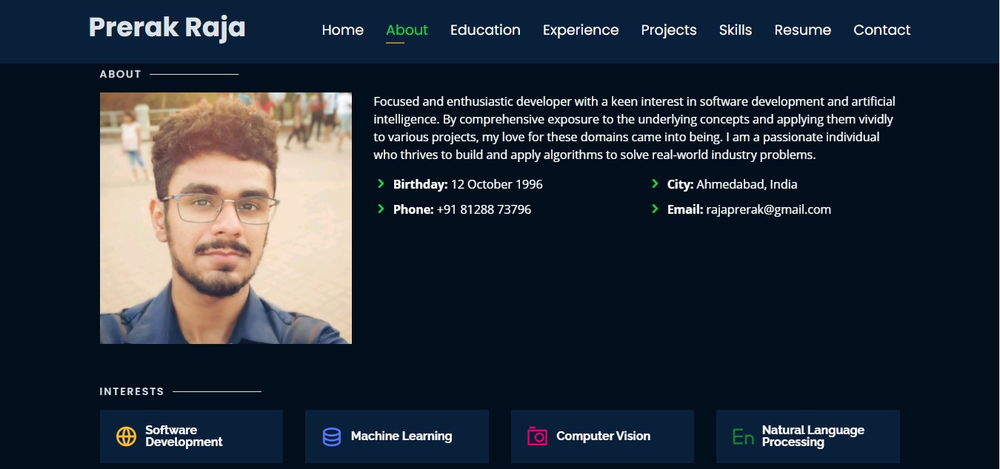
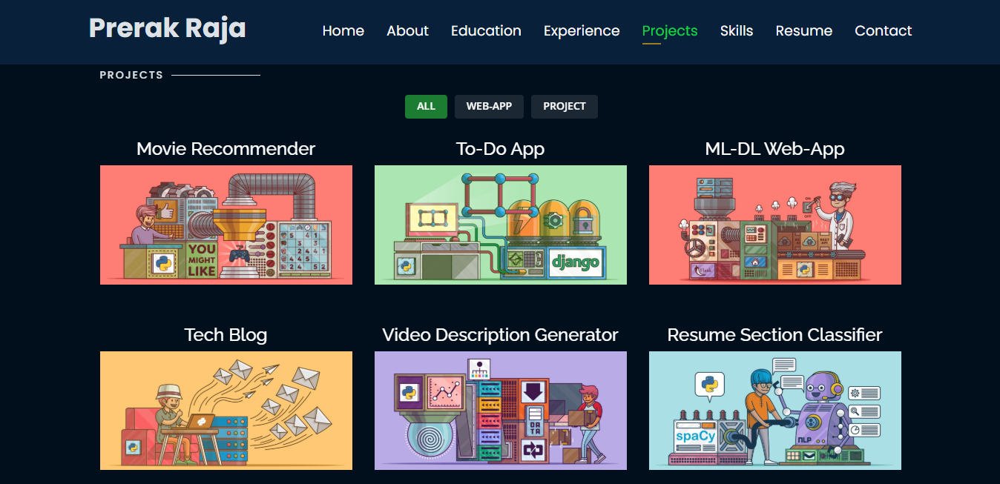

# Joseph Bryan Ferrer (Personal Portfolio)
> https://qjbferrer.github.io/

## Website Preview
### Home Page

### About Page

### Projects Page

  
  
## Hands-on Activities for CPE 232: Managing Enterprise Servers 📚
| Name | Title |
| --- | --- |
| ✔️Hands-on Activity 1| Creating Virtual Machines |
| ✔️Hands-on Activity 2| SSH Key-Based Authentication and GIT Setup |
| ✔️Hands-on Activity 3| Install SSH Server on CentOS and RHEL 8 |
| ✔️Hands-on Activity 4| Ansible Basics |
| ✔️Hands-on Activity 5| Implement Ansible Roles in Playbooks |
| ✔️Major Examination| Prelim Examination |
| ✔️Hands-on Activity 6| Targeting Specific Nodes |
| ✔️Hands-on Activity 7| Managing Files and Creating Roles in Ansible |
| ✔️Hands-on Activity 8| Install, Configure, and Manage Enterprise Availability Monitoring via Ansible |
| ✔️Hands-on Activity 9| Install, Configure, and Manage Enterprise Performance Monitoring via Ansible |
| ✔️Hands-on Activity 10| Install, Configure, and Manage Enterprise Log Monitoring via Ansible |
| ✔️Major Examination| Midterm Examination |
| ✔️Hands-on Activity 11| Containerization |
| ✔️Hands-on Activity 12| Build a Sample Web App in a Docker Container |
| ✔️Hands-on Activity 13| OpenStack Prerequisite Installation |
| ✔️Hands-on Activity 14| OpenStack Installation (Keystone, Glance, Nova) |
| ✔️Hands-on Activity 15| OpenStack Installation (Neutron, Horizon, Cinder) |
